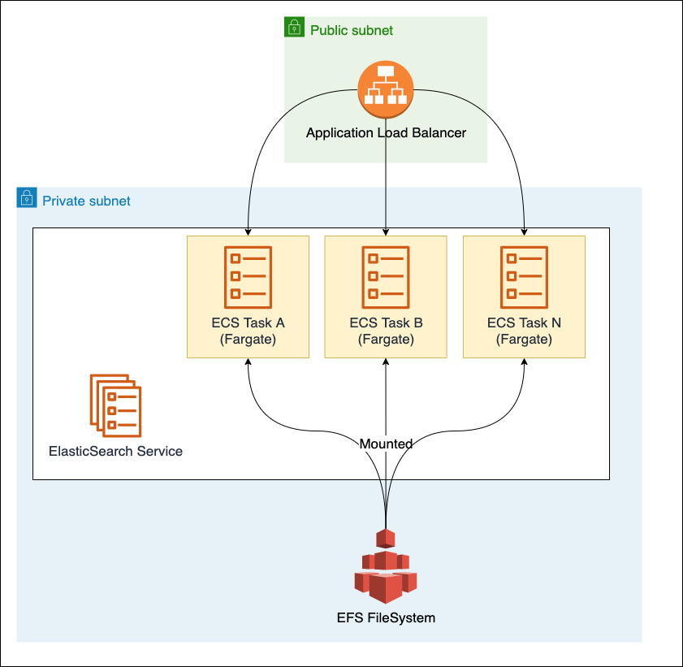

# ElasticSearch on AWS

### Based on AWS CDK, ECS, Fargate, ElasticSearch

This is an experiment in getting ElasticSearch to run in a semi-managed environment.

We start off by creating an AWS ECS Cluster and Fargate containers that run in it. Those containers run the official
ElasticSearch Docker image in Fargate mode.

TODO:
[ ] Healthchecks of ECS service
[ ] Mount an EFS volume so ElasticSearch data is persisted
[ ] Kibana for easier administration
